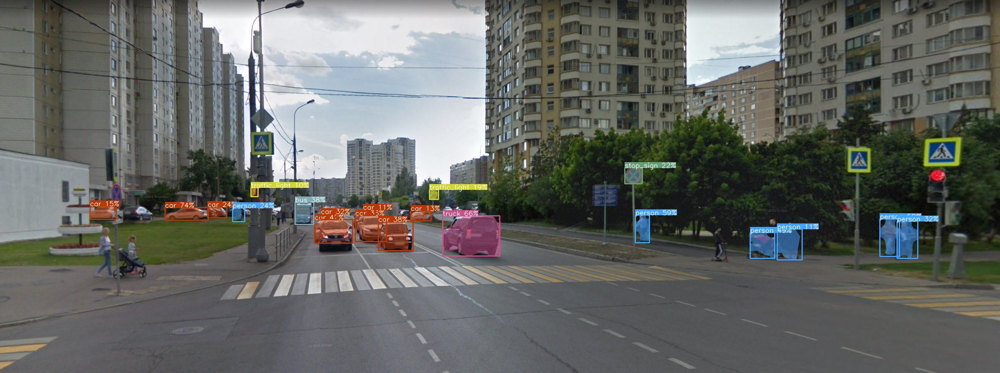

# LOD BOT

Данный Telegram бот демонстрирует возможности следующих моделей YOLOv8, Detectron2 и MiDas.

***
## Установка

1. Клонируйте репозиторий.

   ```
   git clone https://github.com/Shazy021/tele_bot.git
   ```
   
2. Создайте виртуальную среду и активируйте ее.

   ```
   python3 -m venv env
   source env/bin/activate
   ```
   
3. Установите пакеты Python.

   ```
   pip install -r requirements.txt
   ```
   
4. Настроить Telegram-бота.

   - Поговорите с BotFather в Telegram и создайте нового бота.
   - Скопируйте токен бота.
   - Измените файл с именем `setings.py` в каталоге проекта и замените следующую строку:
   
      ```
      TELEGRAM_BOT_TOKEN=<bot_token>
      ```
      
      Замените `<bot_token>` скопированным токеном бота.

***
## Запуск

1. Запустите бота.

   ```
   Python main.py
   ```
   
2. Откройте Telegram и найдите своего бота.

3. Введите команду `/start`.

4. При первом общении с ботом потребуется пройти внутреннюю регистрацию, после чего вам откроется функционал, с которым вы сможете ознакомиться в главном меню.

<p align="center">
  
</p>

***
## Просмотр информации о себе

В данном разделе отображается информация о пользователе, а именно:
* Возраст
* Пол
* Кол-во задетектированных объектов за все время (80 классов)

<p align="center">
  
</p>

***
## Детекция объектов на изображении
В данном разделе есть выбор из 4 моделей:
* `Yolov8` - large
* `Yolov8seg` - large onnx
* `MiDas`
* `Detectron2`

<p align="center">
  
</p>

### Original
<p align="center">
  
</p>

### Yolov8:

<p align="center">
  
</p>

### Yolov8seg:

<p align="center">
  
</p>

### MiDas:

<p align="center">
  
</p>

### Detectron2

<p align="center">
  
</p>

***
## Рандомная фотка лисы
Данный раздел стал отправной точкой по изучению API,
поэтому было принято решение его оставить.

<p align="center">
  
</p>

***
## Удалить информацию о себе из бд
Взаимодействие с данным разделом приведет к удалению вашей учетной
записи из базы данных бота. (На данный момент происходит удаление
только информации о пользователе, статистика по детектируемым объектам
остается)